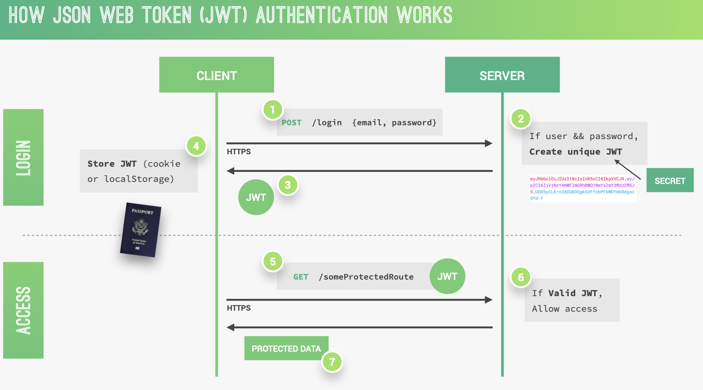
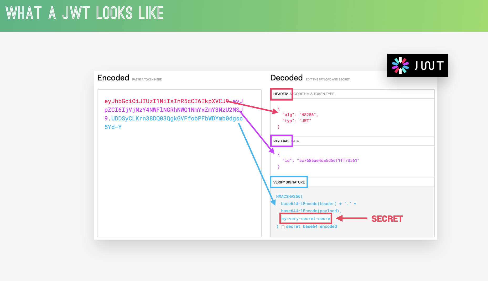
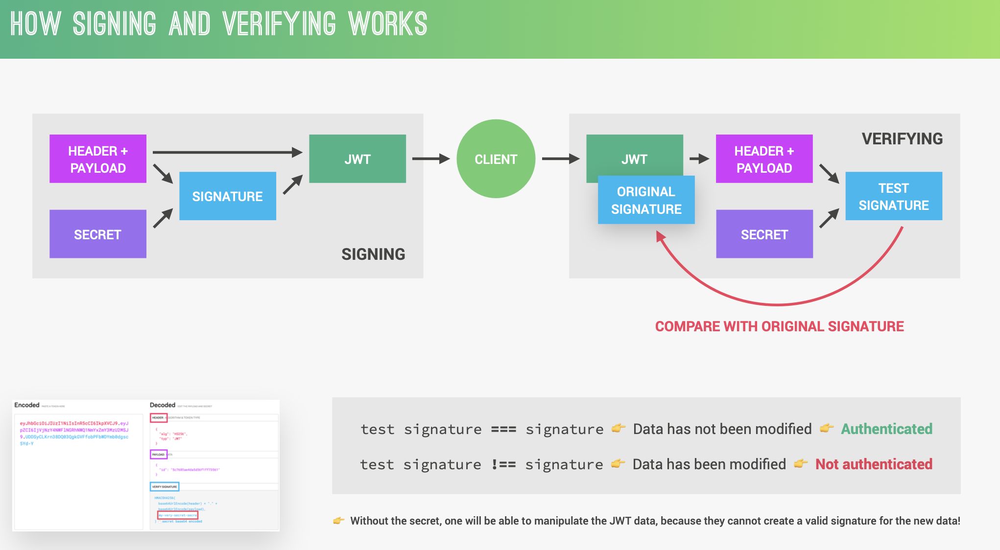

## creating user Schema

as we already learn how to create schema in mongoose, look at the `userModel` file for schema

Let's proceed with the creation of new users based on the model we implemented. We will handle user-related actions such as user creation, user login, and password updates in the authentication controller. This separation allows us to focus on authentication-specific tasks and maintain a more organized code structure.

Now, let's implement the route for the `signup` handler in the userRoutes file. Since the user resource is different from others due to its association with authentication, we need a separate controller and route for it. Import the authentication controller and create a new route using the `router.post` method for the `/signup` URL. Assign the `signup` function to this route. In this case, we only need a POST request, as it is the appropriate method for user signup.

It's worth noting that the `/signup` endpoint deviates from the typical REST architecture we discussed earlier. This endpoint follows a more descriptive naming convention, which aligns better with the action being performed. While other routes follow the REST philosophy, this endpoint serves a specific purpose related to user signup.

Remember that passwords should never be stored as plain text in a database for security reasons. The current implementation demonstrates the basic functionality, but password encryption and additional security measures will be addressed later.

In this lecture, we will focus on managing user passwords in the database. The goal is to ensure the password input matches the confirmed password and encrypt the password to enhance security against potential attacks.

To begin, we need to validate if the two inputted passwords are the same. The ideal place to perform this validation is in the `passwordConfirm` field. Let's create a custom validator for this purpose. We'll utilize the validate property and define a function within a new object.

Inside the validator function, we need to use the `this` keyword, so an arrow function won't work. Remember that a validator function should return either true or false. If it returns false, a validation error occurs. In our case, we want to check if the current element (password confirm) is equal to `this.password`. This simple comparison determines if the passwords match.

It's important to note that this validation only occurs during the `save() and create()` operation. When updating a user, it's crucial to use `save` rather than alternative methods like `findOneAndUpdate`. Failing to do so would bypass the password confirmation validation, which is undesirable.

The next crucial step is to encrypt the plain passwords stored in our database. Storing passwords in plain text is a serious security vulnerability, as it exposes users to potential harm if a hacker gains access to the database. Therefore, it's essential to always encrypt passwords to prevent unauthorized access and protect user data.

To implement password encryption, it's best to handle this functionality within the model. Following the principle of `fat models, thin controllers` encryption is directly related to the data itself and should not be placed in the controller. By doing so, we maintain a cleaner and more organized code structure.

To achieve encryption, we can utilize Mongoose middleware, specifically the `pre-save middleware`, which is a document middleware function. By defining a `pre-hook` on the `save` event in the schema, we can intercept the data before it is persisted to the database. This is the ideal moment to manipulate the data and perform encryption.

The encryption process should occur only when the password field is updated or when a new password is created. If a user is updating other fields, such as the email, we don't need to re-encrypt the password. Mongoose provides a method called `isModified` that allows us to check if a specific field has been modified. In this case, we use `this.isModified('password')` to determine if the password has been modified.

If the password hasn't been modified, we can exit the function, skip the encryption code, and proceed to the next middleware. However, if the password has been modified, we can proceed with the encryption process.

For encryption, we will use a widely recognized and extensively studied hashing algorithm called `bcrypt`. This algorithm employs `salting and hashing techniques` to create strong password encryption that defends against brute force attacks. Salting involves adding a random string to the password before hashing, ensuring that identical passwords generate different hashes. This adds an extra layer of security.

While the inner workings and cryptographic details of bcrypt are complex, it's important to understand that bcrypt is a reliable and well-regarded encryption solution. It provides a robust defense against potential attacks and ensures the security of user passwords.

Let's now proceed to utilize the bcryptjs package to implement the bcrypt algorithm.

We want to hash the current password stored in this document using `bcrypt.hash` function. This function requires a `cost parameter` to be specified. There are two ways to handle the salt generation: manually generating the salt or passing a cost parameter directly.

To simplify the process, we'll use the cost parameter. It determines the CPU intensity of the hashing operation and, consequently, the strength of the encrypted password. By default, the cost value is 10, but it's recommended to use a higher value like 12 in modern systems. You could increase the value further, but it would significantly slow down the process.

It's important to mention that `bcrypt.hash` is an asynchronous function. To handle it properly, we need to mark the surrounding function as async and use await to wait for the promise returned by `bcrypt.hash`.

To summarize, we are encrypting the current password using a cost of 12. This strikes a balance between password security and encryption speed. Once the encryption is complete, we no longer need the `confirm password field`, so we can set it to `undefined` to avoid persisting it in the database.

You might wonder why setting passwordConfirm to undefined works when it's marked as a required field. The required attribute only ensures it's an input requirement, not a database persistence requirement.

Finally, don't forget to call `next` to move to the next middleware. To provide more clarity, I've added comments explaining each step.

With the implementation complete, let's test it by creating a new user with the provided data. You'll notice that the password is now a weird-looking string, which is the encrypted version of "pass1234". Also, the `passwordConfirm` field is no longer present.

Additionally, it's worth noting that even if two users input the same password, the resulting encrypted passwords will be different. This is due to the salting process, which adds a random string to the password before hashing it. This significantly enhances the security of the passwords stored in the database.

With these steps, we have successfully implemented secure password management using bcryptjs.

## JWT

Now that we have set up our user model to securely store user information, our next step is to implement user authentication and authorization. In simple terms, this involves allowing users to log in and granting them access to certain protected resources that non-logged-in users cannot reach.

There are various authentication methods available, but we will be using a modern, simple, and secure approach called `JSON Web Tokens (JWT)`. JSON Web Tokens provide a `stateless solution` for authentication, which means there is no need to store session state on the server. This aligns perfectly with the principles of RESTful APIs, which should always be stateless.

The most commonly used alternative to JWT authentication is storing the user's login state on the server using sessions. However, this approach goes against the principle of statelessness in RESTful APIs, which is why we are opting for JWT.

Now, let's delve into how authentication actually works with JSON Web Tokens. Assuming we already have a registered user in our database, here is the process of a user logging into the app:

1. The user's client initiates a POST request with the username or email and password.
2. The application verifies if the user exists and if the password is correct.
3. If the credentials are valid, a unique JSON Web Token is created for that user using a secret string stored on the server. A JWT is simply a string that represents the user's authentication.
4. The server sends the JWT back to the client, which can store it either in a cookie or in local storage.
5. With the JWT, the user is authenticated and effectively logged into our application, without any server-side state.
6. The server does not maintain information about which users are logged in. However, the user possesses a valid JSON Web Token, which serves as a passport granting access to protected parts of the application.

To reiterate, a user is logged in as soon as they receive their unique, valid JSON Web Token, which is not saved anywhere on the server. This process is completely stateless. Whenever the user wants to access a protected route, such as their user profile data, they include their JSON Web Token in the request. It's akin to showing a passport to gain access to a specific route.

When the request reaches the server, our application verifies the validity of the JSON Web Token, ensuring that the user is who they claim to be. More details on this verification step will be discussed later.

If the token is valid, the requested data is sent to the client. If not, an error message informs the user that they are not authorized to access the resource. This process repeats each time the user requests data from any protected route.

It is crucial to note that all communication must occur over HTTPS, which provides secure, encrypted HTTP connections. This ensures that passwords and JSON Web Tokens remain protected, thereby creating a truly secure system. We will delve further into this topic in a later section.

At first glance, understanding authentication using JSON Web Tokens (JWT) can seem confusing. However, the underlying principle is actually quite simple. To delve deeper into how JWT works, let's examine its components and the process involved.

A JSON Web Token consists of `three parts: the header, the payload, and the signature`. The header contains metadata about the token, while the payload is the data that can be encoded into the token. Both the header and the payload are plain text and are not encrypted. Therefore, it is important not to store sensitive information in them. The third part, the signature, is where things get interesting.

The signature is created using the header, the payload, and a secret that is securely saved on the server. This process is referred to as signing the JSON Web Token. The signing algorithm combines these components with the secret to create a unique signature. Only by using the same data and secret can the signature be reproduced. When combined with the header and the payload, the signature forms the complete JWT, which is then sent to the client.

Upon receiving a JWT to grant access to a protected route, the server needs to verify it to ensure that the user is who they claim to be. This verification step confirms that neither the header nor the payload of the JSON Web Token has been tampered with. The verification process is straightforward.

To verify the JWT, the server takes its header and payload along with the secret stored on the server and creates a test signature. Meanwhile, the original signature generated when the JWT was first created remains within the token. The key to verification lies in comparing the test signature with the original signature. If the two signatures match, it means that the payload and header have not been modified. This allows the server to authenticate the user. On the other hand, if the two signatures differ, it indicates that someone has tampered with the data, typically by modifying the payload. However, since the third party manipulating the payload does not have access to the secret, they cannot create a valid signature for the manipulated data. Therefore, the verification will always fail in this case.

This verification process is what makes the JWT system work securely. Without the secret, it is impossible to manipulate the JWT data and create a valid signature for the altered data. Although the inner workings of the JWT algorithms are complex, it is crucial to comprehend the underlying process. However, implementing these algorithms manually is unnecessary, as there are existing libraries that handle the complexity.

In conclusion, understanding the principles behind JWT authentication is essential for working with the technology effectively. JSON Web Tokens provide a simple yet powerful method for authentication. By using the secret to create a signature and comparing it during verification, the integrity of the token's data can be ensured. It's important to grasp these concepts before diving into practical implementation, which we will explore in subsequent lectures.
