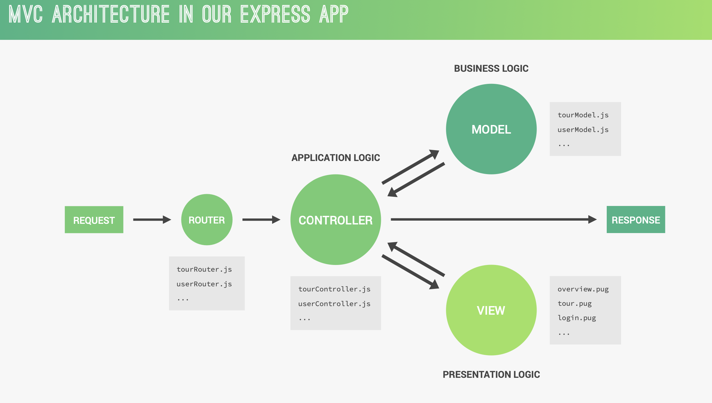

## mongodb atlas setup with mongoose

In order to access and interact with a MongoDB database in our Node.js code, we need to install a MongoDB driver. There are several MongoDB drivers available, but we will be using the most popular one called Mongoose. Mongoose offers additional features on top of the native MongoDB driver.

install the mongoose and require it in `server.js`

Now we can use the mongoose variable to connect to the MongoDB database. To establish the connection, call the connect method on the mongoose object.

The connect method returns a promise, so we can use the then method to handle the resolved value, which is a connection object. In the then callback, log the connection object to the console to verify the successful connection.

in `mogoose.connect(<database_url>, <options>)`
Firstly, we have the connection string, which is passed as the first argument when calling the connect method. This string represents the address and credentials needed to connect to the database.

Next, we provide an object as the second argument, containing various options that help us handle deprecation warnings. These options ensure that our code remains compatible with future versions of the database driver.

for better understanding of this options parameter go to [link](https://arunrajeevan.medium.com/understanding-mongoose-connection-options-2b6e73d96de1)

## mongodb schema and model

When working with Mongoose, models play a vital role. They act as blueprints that allow us to create documents. In a way, they resemble classes in JavaScript, which we use as templates for creating objects. Similarly, we create a model in Mongoose to create, query, update, and delete documents—a set of operations commonly referred to as CRUD (Create, Read, Update, Delete).

To execute each CRUD operation, we require a Mongoose model. To establish a model, we first need a schema. As we learned in the previous video, we construct models using Mongoose schemas. A schema serves as a framework for defining the structure of our data, specifying default values, validating data integrity, and handling various other tasks.

## simple schema and model for our tour

Let's dive into creating a simple schema for our tours using Mongoose, a MongoDB object modeling tool. A schema defines the structure and validation rules for the data in our database. We'll start by using the `tourSchema` variable, which represents a new instance of the `mongoose.Schema` class.

Inside the `tourSchema` object, we define the fields for our tour documents. In the previous section, we explored Mongoose DB and created tour documents with fields like name, rating, and price. We replicate this structure in our schema definition by specifying each field and its corresponding data type. For example, we define the name field as a string, rating as a number, and price also as a number. Mongoose uses JavaScript native data types for these definitions.

While the basic way of describing a schema is to define the fields and their data types, we can go a step further by adding schema type options. These options allow us to specify additional properties for each field. For instance, instead of just specifying name as a string, we can pass in an object with more options. One useful option is required, which ensures that the field must have a value. We set `required: true` for the name field, indicating that it must always be provided. Similarly, we set `required: true` for the rating and price fields.

Additionally, we can set default values for fields. In this case, we set a default value of 4.5 for the rating field. If we create a new tour document without specifying the rating, it will automatically be set to 4.5.

Another option we can utilize is `unique`. We can set unique: true for the name field, ensuring that each tour document has a unique name. This prevents two tours from having the same name.

After defining our schema, we can create a model using the `mongoose.model` method. We assign this model to a variable called Tour with an uppercase "T" to follow programming conventions. The model name should typically be in uppercase. We pass the name of the model (in this case, "Tour") and the `tourSchema` as second arguments to the `mongoose.model` method.

With our schema and model set up, we can now proceed to create our first tour document using the Tour model.

To summarize, we've used the `mongoose.Schema` class to define a schema for our tour data. The schema describes the structure of our documents and includes data validation. We can specify various schema type options for each field, such as required and unique. These options help ensure data integrity and provide validation for our data. By creating a model using the schema, we can easily interact with our MongoDB database and perform CRUD operations on our tour documents.

To begin, we'll create a new variable called `testTour` This variable will represent a new document created from the `Tour` model. We achieve this by instantiating the tour model using the "new" keyword and passing an object containing the relevant data. For instance

In essence, we are using JavaScript function constructors (or classes in ES6) to create new Object from a class. While the syntax may not be identical, this analogy helps illustrate the concept. The "testTour" document we just created is an instance of the tour model, allowing us to leverage various methods to interact with the database.

One such method is "save." By invoking "testTour.save," we store the document in the tours collection of the database. It's a straightforward process that enables persistence of our data. The "save" method returns a promise, which we can handle using the "then" method

Within the "then" block, we gain access to the document that was just saved to the database. This result represents the final state of the document as it exists in the database. Let's log this document to the console to inspect its contents. Additionally, we need to handle potential errors that may occur during the save operation. Using the "catch" method, we can gracefully capture and handle any errors that arise, ensuring our code remains robust.

## Model-View-Controller (MVC) architecture.

as our app grows in complexity, it becomes crucial to pay attention to the design of our code architecture. In this lecture, we will provide a brief introduction to back-end architecture, specifically the Model-View-Controller (MVC) architecture.

The MVC architecture is a widely used and well-known approach that we will adopt for this project. Different implementations of MVC exist, some more complex than others, but we will follow a straightforward approach.

In the MVC architecture, the model layer is responsible for managing application data and handling the business logic. The business logic refers to the rules and operations that govern how data is processed and manipulated within the application. We will explore this concept further in the next slide.

Next, we have the controller layer, which handles the application's requests, interacts with the models, and sends back responses to the client. This layer encompasses the application logic, orchestrating the flow of data between the model and the client.

The view layer comes into play when our application has a graphical interface or if we are building a server-side rendered website, as discussed earlier. The view layer consists of templates used to generate the view, which is the website sent back to the client. The view layer represents the presentation logic.

For now, our focus is on building an API, so we are not yet concerned with views. We will delve into views later in the course when we discuss server-side rendering.

Adopting an architecture like MVC enables us to develop a more modular application, which is easier to maintain and scale as the application grows. It is possible to add additional layers of abstraction to further enhance the architecture, but for our current purposes, MVC is more than sufficient.

Although this might seem abstract, let's now examine how MVC fits into the context of our application and the request-response cycle.

Adopting an architecture like MVC enables us to develop a more modular application, which is easier to maintain and scale as the application grows. It is possible to add additional layers of abstraction to further enhance the architecture, but for our current purposes, MVC is more than sufficient.

Although this might seem abstract, let's now examine how MVC fits into the context of our application and the request-response cycle.

The process begins with a client request. The request is received by one of our routers, as we have multiple routers for different resources such as tours, users, and so on. The role of the router is to direct the request to the appropriate handler function, which resides within the controllers. Each resource has its own controller, ensuring clear separation between different parts of the application.

Depending on the nature of the incoming request, the controller may need to interact with one of the models. For example, it might retrieve a specific document from the database or create a new one. There is a corresponding model file for each resource in our application.

After obtaining the necessary data from the model, the controller prepares a response to be sent back to the client. This response could include the retrieved data or any other relevant information.

If our intention is to render a website, an additional step is involved. After retrieving data from the model, the controller selects a view template and injects the data into it. The rendered website is then sent back as the response to the client. In an Express app's view layer, typically, there is one view template for each page, such as a tour overview page, a tour detail page, or a login page.

This overview provides a broad understanding of the architecture we will implement in this project. To conclude, let's delve into more detail about the model and controller components.

To delve deeper into the concepts of model and controller in the MVC architecture, let's clarify their roles and understand how they contribute to the separation of business logic and application logic.

Application logic pertains to the code that focuses solely on the implementation of the application itself, rather than the underlying business problem that the application aims to solve like involves tasks such as displaying and selling tours, managing supermarket stock, or organizing a library. In essence, application logic ensures that the application functions correctly. For instance, in the context of Express, a significant part of the application logic deals with handling requests and responses. Therefore, application logic is primarily concerned with the technical aspects of the application. Additionally, when views are present in the app, application logic acts as a bridge connecting the model and view layers, ensuring that business logic and presentation logic remain separate.

On the other hand, business logic refers to the code that directly addresses the business problem at hand. It encompasses the rules, workings, and requirements specific to the business. To illustrate, suppose our objective is to display and sell tours to customers. The code responsible for implementing the business rules, such as adding new tours to the app's database, verifying the correctness of a user's password during login, validating user input data, or restricting reviews to users who have purchased a particular tour, falls under the umbrella of business logic. Essentially, business logic is centered around the core operations of the business.

While it's challenging to completely separate application logic and business logic, it's crucial to make an effort to do so. Controllers should primarily handle application logic, while models should focus on business logic. Some developers advocate for the principle of "fat models, thin controllers," which suggests offloading as much logic as possible into the models to keep controllers simple and streamlined. Consequently, a "fat" model contains a significant amount of business logic, while a "thin" controller has minimal logic, mainly responsible for managing the application's requests and responses.

Remember that these concepts should guide us as we progress in building our applications, understanding the importance of maintaining the separation between application logic and business logic within the MVC architecture.

## refactoring code

After learning about the Model-View-Controller (MVC) architecture, it's time to refactor our code to align with this structure. Currently, we already have a controller folder with the tour and user controllers, as well as a routes folder. In this video, our focus is on creating a model folder and a tour model within it.

Next, we need to import the tour model in the tourController, where we will be creating, querying, deleting, and updating tours.

We no longer need to import the data from a JSON file for testing purposes, so that code can be removed or commented out. Similarly, we can comment out the code that throws an error due to the deleted variable.

Delete all the unwanted code
