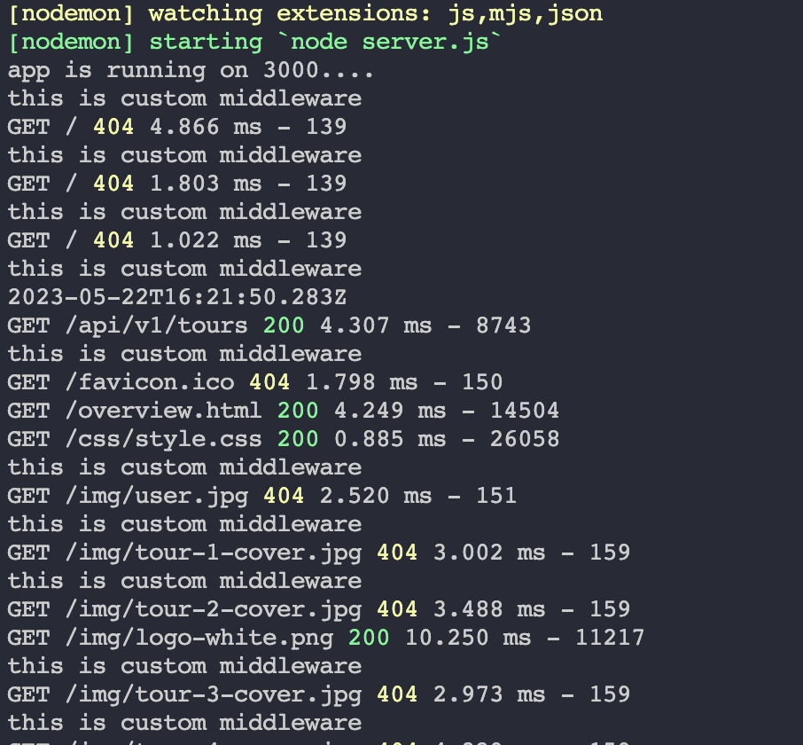

In this section, we'll delve into serving static files with Express and explore what static files actually are. Static files refer to the files in our file system that cannot be accessed using regular routes. For instance, we have an overview.html file in our public folder, but currently, there is no way to access it through a browser. The same goes for image files, CSS, and JavaScript files. To demonstrate this, let's use a browser and try accessing the overview.html file by copying its URL.

When we try to access the file directly, we realize it's not accessible because we haven't defined a route for it. To overcome this limitation and enable access to files from our file system, we need to use a built-in Express middleware. Let's see how we can accomplish that. We'll use the Express.static middleware, which is designed specifically for serving static files. By passing the directory path of the static files, we can instruct Express to serve them. In this case, we'll use the public directory where our HTML files are located.

After including this middleware, we can access the static files. For example, we can access the overview.html file by simply entering "/overview.html" in the URL, without including the "public" folder. This works because when Express can't find a matching route, it looks in the specified public folder as a fallback. In essence, the public folder becomes the root for serving static files. Similarly, we can access image files, such as "pin.png," by including the appropriate path in the URL.

However, it's important to note that this mechanism only works for serving static files and not for regular routes. If we try to access a URL that doesn't correspond to a file, Express will attempt to find a route handler, which will result in a 404 error if not defined.

Now, let's take a look at the console to observe the requests made when opening the overview.html page. By clearing the console and refreshing the page, we can see all the requests made for the page assets. Each asset, such as images, CSS files, or JavaScript files, triggers a separate request to the server. In this case, we can observe that most of these requests return a 404 error because Express cannot locate the requested files in the specified folder. It's worth mentioning that this demonstration focuses solely on serving static files, and the broken links on the page serve as visual feedback rather than functional elements.
