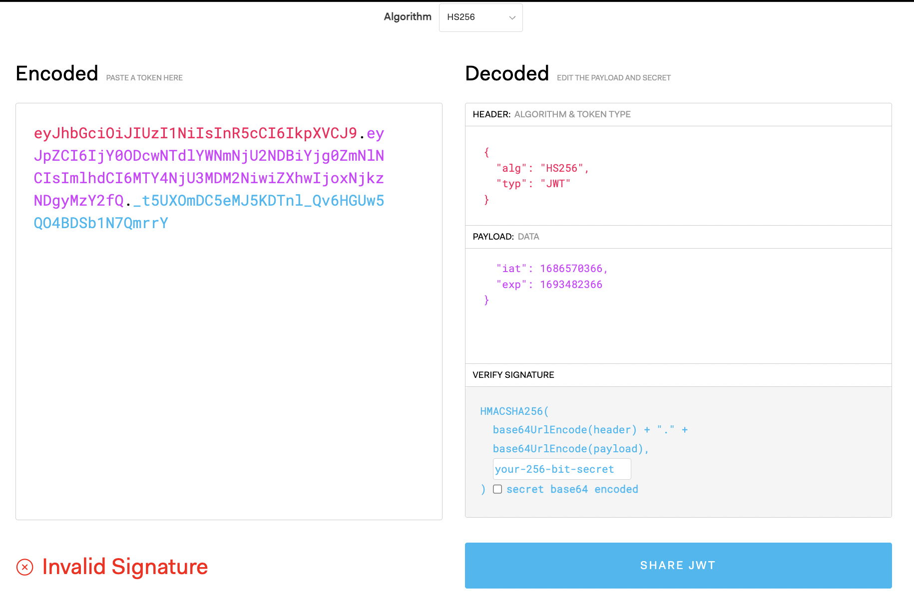

## creating user Schema

as we already learn how to create schema in mongoose, look at the `userModel` file for schema

Let's proceed with the creation of new users based on the model we implemented. We will handle user-related actions such as user creation, user login, and password updates in the authentication controller. This separation allows us to focus on authentication-specific tasks and maintain a more organized code structure.

Now, let's implement the route for the `signup` handler in the userRoutes file. Since the user resource is different from others due to its association with authentication, we need a separate controller and route for it. Import the authentication controller and create a new route using the `router.post` method for the `/signup` URL. Assign the `signup` function to this route. In this case, we only need a POST request, as it is the appropriate method for user signup.

It's worth noting that the `/signup` endpoint deviates from the typical REST architecture we discussed earlier. This endpoint follows a more descriptive naming convention, which aligns better with the action being performed. While other routes follow the REST philosophy, this endpoint serves a specific purpose related to user signup.

Remember that passwords should never be stored as plain text in a database for security reasons. The current implementation demonstrates the basic functionality, but password encryption and additional security measures will be addressed later.

In this lecture, we will focus on managing user passwords in the database. The goal is to ensure the password input matches the confirmed password and encrypt the password to enhance security against potential attacks.

To begin, we need to validate if the two inputted passwords are the same. The ideal place to perform this validation is in the `passwordConfirm` field. Let's create a custom validator for this purpose. We'll utilize the validate property and define a function within a new object.

Inside the validator function, we need to use the `this` keyword, so an arrow function won't work. Remember that a validator function should return either true or false. If it returns false, a validation error occurs. In our case, we want to check if the current element (password confirm) is equal to `this.password`. This simple comparison determines if the passwords match.

It's important to note that this validation only occurs during the `save() and create()` operation. When updating a user, it's crucial to use `save` rather than alternative methods like `findOneAndUpdate`. Failing to do so would bypass the password confirmation validation, which is undesirable.

The next crucial step is to encrypt the plain passwords stored in our database. Storing passwords in plain text is a serious security vulnerability, as it exposes users to potential harm if a hacker gains access to the database. Therefore, it's essential to always encrypt passwords to prevent unauthorized access and protect user data.

To implement password encryption, it's best to handle this functionality within the model. Following the principle of `fat models, thin controllers` encryption is directly related to the data itself and should not be placed in the controller. By doing so, we maintain a cleaner and more organized code structure.

To achieve encryption, we can utilize Mongoose middleware, specifically the `pre-save middleware`, which is a document middleware function. By defining a `pre-hook` on the `save` event in the schema, we can intercept the data before it is persisted to the database. This is the ideal moment to manipulate the data and perform encryption.

The encryption process should occur only when the password field is updated or when a new password is created. If a user is updating other fields, such as the email, we don't need to re-encrypt the password. Mongoose provides a method called `isModified` that allows us to check if a specific field has been modified. In this case, we use `this.isModified('password')` to determine if the password has been modified.

If the password hasn't been modified, we can exit the function, skip the encryption code, and proceed to the next middleware. However, if the password has been modified, we can proceed with the encryption process.

For encryption, we will use a widely recognized and extensively studied hashing algorithm called `bcrypt`. This algorithm employs `salting and hashing techniques` to create strong password encryption that defends against brute force attacks. Salting involves adding a random string to the password before hashing, ensuring that identical passwords generate different hashes. This adds an extra layer of security.

While the inner workings and cryptographic details of bcrypt are complex, it's important to understand that bcrypt is a reliable and well-regarded encryption solution. It provides a robust defense against potential attacks and ensures the security of user passwords.

Let's now proceed to utilize the bcryptjs package to implement the bcrypt algorithm.

We want to hash the current password stored in this document using `bcrypt.hash` function. This function requires a `cost parameter` to be specified. There are two ways to handle the salt generation: manually generating the salt or passing a cost parameter directly.

To simplify the process, we'll use the cost parameter. It determines the CPU intensity of the hashing operation and, consequently, the strength of the encrypted password. By default, the cost value is 10, but it's recommended to use a higher value like 12 in modern systems. You could increase the value further, but it would significantly slow down the process.

It's important to mention that `bcrypt.hash` is an asynchronous function. To handle it properly, we need to mark the surrounding function as async and use await to wait for the promise returned by `bcrypt.hash`.

To summarize, we are encrypting the current password using a cost of 12. This strikes a balance between password security and encryption speed. Once the encryption is complete, we no longer need the `confirm password field`, so we can set it to `undefined` to avoid persisting it in the database.

You might wonder why setting passwordConfirm to undefined works when it's marked as a required field. The required attribute only ensures it's an input requirement, not a database persistence requirement.

Finally, don't forget to call `next` to move to the next middleware. To provide more clarity, I've added comments explaining each step.

With the implementation complete, let's test it by creating a new user with the provided data. You'll notice that the password is now a weird-looking string, which is the encrypted version of "pass1234". Also, the `passwordConfirm` field is no longer present.

Additionally, it's worth noting that even if two users input the same password, the resulting encrypted passwords will be different. This is due to the salting process, which adds a random string to the password before hashing it. This significantly enhances the security of the passwords stored in the database.

With these steps, we have successfully implemented secure password management using bcryptjs.

## JWT


Now that we have set up our user model to securely store user information, our next step is to implement user authentication and authorization. In simple terms, this involves allowing users to log in and granting them access to certain protected resources that non-logged-in users cannot reach.

There are various authentication methods available, but we will be using a modern, simple, and secure approach called `JSON Web Tokens (JWT)`. JSON Web Tokens provide a `stateless solution` for authentication, which means there is no need to store session state on the server. This aligns perfectly with the principles of RESTful APIs, which should always be stateless.

The most commonly used alternative to JWT authentication is storing the user's login state on the server using sessions. However, this approach goes against the principle of statelessness in RESTful APIs, which is why we are opting for JWT.

Now, let's delve into how authentication actually works with JSON Web Tokens. Assuming we already have a registered user in our database, here is the process of a user logging into the app:

1. The user's client initiates a POST request with the username or email and password.
2. The application verifies if the user exists and if the password is correct.
3. If the credentials are valid, a unique JSON Web Token is created for that user using a secret string stored on the server. A JWT is simply a string that represents the user's authentication.
4. The server sends the JWT back to the client, which can store it either in a cookie or in local storage.
5. With the JWT, the user is authenticated and effectively logged into our application, without any server-side state.
6. The server does not maintain information about which users are logged in. However, the user possesses a valid JSON Web Token, which serves as a passport granting access to protected parts of the application.

To reiterate, a user is logged in as soon as they receive their unique, valid JSON Web Token, which is not saved anywhere on the server. This process is completely stateless. Whenever the user wants to access a protected route, such as their user profile data, they include their JSON Web Token in the request. It's akin to showing a passport to gain access to a specific route.

When the request reaches the server, our application verifies the validity of the JSON Web Token, ensuring that the user is who they claim to be. More details on this verification step will be discussed later.

If the token is valid, the requested data is sent to the client. If not, an error message informs the user that they are not authorized to access the resource. This process repeats each time the user requests data from any protected route.

It is crucial to note that all communication must occur over HTTPS, which provides secure, encrypted HTTP connections. This ensures that passwords and JSON Web Tokens remain protected, thereby creating a truly secure system. We will delve further into this topic in a later section.


At first glance, understanding authentication using JSON Web Tokens (JWT) can seem confusing. However, the underlying principle is actually quite simple. To delve deeper into how JWT works, let's examine its components and the process involved.

A JSON Web Token consists of `three parts: the header, the payload, and the signature`. The header contains metadata about the token, while the payload is the data that can be encoded into the token. Both the header and the payload are plain text and are not encrypted. Therefore, it is important not to store sensitive information in them. The third part, the signature, is where things get interesting.


The signature is created using the header, the payload, and a secret that is securely saved on the server. This process is referred to as signing the JSON Web Token. The signing algorithm combines these components with the secret to create a unique signature. Only by using the same data and secret can the signature be reproduced. When combined with the header and the payload, the signature forms the complete JWT, which is then sent to the client.

Upon receiving a JWT to grant access to a protected route, the server needs to verify it to ensure that the user is who they claim to be. This verification step confirms that neither the header nor the payload of the JSON Web Token has been tampered with. The verification process is straightforward.

To verify the JWT, the server takes its header and payload along with the secret stored on the server and creates a test signature. Meanwhile, the original signature generated when the JWT was first created remains within the token. The key to verification lies in comparing the test signature with the original signature. If the two signatures match, it means that the payload and header have not been modified. This allows the server to authenticate the user. On the other hand, if the two signatures differ, it indicates that someone has tampered with the data, typically by modifying the payload. However, since the third party manipulating the payload does not have access to the secret, they cannot create a valid signature for the manipulated data. Therefore, the verification will always fail in this case.

This verification process is what makes the JWT system work securely. Without the secret, it is impossible to manipulate the JWT data and create a valid signature for the altered data. Although the inner workings of the JWT algorithms are complex, it is crucial to comprehend the underlying process. However, implementing these algorithms manually is unnecessary, as there are existing libraries that handle the complexity.

### jwt implementation

In this lecture, we will enhance our signup functionality by implementing the user login process, making it a more complete signup experience. This marks the beginning of our authentication implementation, which is a critical and complex aspect of web development.

We must exercise extreme caution when writing this part of the application because it involves handling sensitive user data and building trust with users. While there are libraries like Passport available for authentication and authorization, it's important to understand that even with such libraries, the responsibility ultimately lies with the developer.

In our case, we will implement the entire login, protection, and authorization logic ourselves, except for the JSON Web Token (JWT) implementation we discussed in the previous video. The JWT library will handle the signing and verification aspects, while we will focus on the remaining implementation over the next few lectures.

Now, let's discuss a security flaw we discovered in the current signup process. Currently, when a new user signs up, we create a new user object using all the data provided in the request body. see below

```js
// in authController
const newUser = await User.create(req.body);
```

The problem arises because anyone can specify their role as an admin during registration. This poses a significant security risk, as anyone can register as an admin within our application. Clearly, this is unacceptable.

To address this flaw, we need to modify our code. Instead of allowing all the incoming data to be stored in the new user object, we should only allow specific data, such as name, email, and password. To implement this fix. replace above line with below code:

```js
// in authController
const newUser = await User.create({
  name: req.body.name,
  email: req.body.email,
  password: req.body.password,
  passwordConfirm: req.body.passwordConfirm,
});
```

This modification ensures that even if a user tries to input their role or other unnecessary data, it won't be stored in the new user object.

To create a token, we use the `JWT.sign()` function. First, we define the payload, which is an object containing the data we want to store inside the token. In this case, we only need the `user's ID`, so we extract it from the newly created user object. In MongoDB, the ID is referred to as `_id`. This payload object will be added to our JWT.

Next, we need a `secret string`. Ideally, this secret should be stored securely, such as in a configuration file, and not hard-coded in the code. We can create a configuration variable called `JWT_SECRET` to store the secret. It's important to use a strong and unique secret for encryption. The recommended length for the secret, when using the standard HSA 256 encryption, is at least 32 characters. It's crucial to choose a different secret than the one provided here for security reasons.

Now, let's return to the authentication controller and actually use the token. The secret can be accessed through the environment variable `process.env.JWT_SECRET`. With the payload and secret in place, the token header will be automatically generated. Additionally, we can pass options to the `sign()` function. One useful option is specifying the expiration time for the token. This ensures that the token becomes invalid after a certain period, even if it is otherwise correctly verified. It's common practice to define the expiration time as a configuration variable, such as "JWT expires in". We can use special strings like "90D" to represent 90 days, and the signing algorithm will interpret it accordingly. This expiration time adds an extra layer of security by automatically logging out the user after the specified period.

These options are passed as an object to the `sign()` function, specifically using the `expiresIn` property. We can access the "JWT expires in" configuration variable through "process.env.JWT expires in". This way, the token will have the defined expiration time.

Now, let's proceed with sending the token we just created to the client. To do this, we'll place the token in the response before sending it back to the user. This step completes the process of logging in a new user. It's important to note that at this point, we're not checking whether the password is correct or if the user actually exists in the database. In this case, we've just created a new user, and immediately logged them into the application by sending a token.

Now, I want to show you the JWT debugger that I mentioned in the previous video. Let's copy the token and go to `jwt.io`. Once there, we'll use the debugger feature.



Upon pasting, you'll notice that our signature is invalid. This is because the sign function modified the `iat` (issued at) and `exp` (expiration time) properties. These two properties were automatically set when we specified an expiration date. If we remove these properties from the token, you'll see that the signature is now verified.

It's important to note that the header of the JWT is easily decodable and visible. We didn't specify any values for the header, as the JSON Web Token package automatically handled it for us. On the other hand, the payload section contains the data we specified. If we examine the `id` field, it should match the one we see in Postman.

As for the signature, we can't view it because it's encrypted using our secret key, which, as the name suggests, remains secret.

In this lecture, we will focus on implementing the functionality of logging in users based on their email address and password. Similar to previous lessons, logging in involves signing a JSON web token (JWT) and sending it back to the client. However, in this case, we will only issue the token if the user exists and the password is correct. Let's dive into the implementation.

We begin by defining the login function in our code. This function takes in three parameters: request, response, and next. Our first task is to extract the `email` and `password` from the request body. We can achieve this by using object destructuring in JavaScript.

Now, we need to check if both email and password exist. If either of them is missing, we want to send an error message to the client. To accomplish this, we can utilize the error handling tools implemented in the previous section. We create a new instance of the `AppError` class, passing in the error message and HTTP error code, and then pass it to the next middleware function using `next()`.

Moving on, the second step is to check if the user exists and if the provided password is correct. We will implement this step later.

To test the implementation, we can make a POST request to the `/login` endpoint with the necessary login credentials in the request body. If either the email or password is missing, we should receive an error message as a response. Otherwise, if everything is correct, we should receive the JSON web token.

Now, let's move on to checking if a user exists for the provided email. We'll use the `findOne` method to search for a user based on their email, instead of using the ID like we did previously. We pass a filter object to the findOne method, specifying the email field to match the provided email.

Before proceeding, it's important to address a security concern. When signing up for a new account and examining the user output in Postman, we can see that the password is included. Although the password is encrypted, it's not good practice to expose sensitive data to the client. We don't want the password to be visible even if we were to implement a route for retrieving all users. To fix this, we can exclude the password field from the output by setting `select:false` in schema. This ensures that it never shows up in any output.

after examing This is important because when we perform a find operation in the `AuthController`, the password will also be excluded from the output.

However, we still need the password to compare it with the one provided by the user during the login process. To achieve this, we need to explicitly select the password field. We can use the `select` method, as we did before, to choose specific fields from the database. In this case, since the password field is not selected by default, we need to explicitly select it using user `+password`.
now query will look like `await User.findOne({ email }).select('+password')`

Now, we need to compare the passwords. However, comparing the provided password

To compare passwords securely, we can utilize the bcrypt package. This package allows us to generate a hashed password and also compare an original password with its hashed counterpart.

To perform the comparison, we need to encrypt the candidate password and then compare it with the stored hashed password. In our implementation, we will use the bcrypt package within the user model, as it is closely related to the data itself. bcrypt do encrption of password provided by user and then compare encrypted password with hashed password stored in database.

To achieve this, we'll create a function called `correctPassword` as an `instance method`. An instance method is a method that is available on all documents of a specific collection. In this case, it will be defined within the userSchema using the `methods` property. The correctPassword function takes the candidatePassword (the password provided by the user) and userPassword (the stored hashed password) as parameters.

Inside this instance method, the this keyword refers to the current document. However, since we have set the password field to `select: false`, the `this.password` property will not be accessible. As a workaround, we need to pass in the userPassword as a parameter.

The goal of the correctPassword function is to return either true or false based on whether the passwords match or not. To achieve this, we use the compare function provided by bcrypt. This function takes the candidatePassword and userPassword as arguments and returns true if they match, and false otherwise.

Since the compare function is asynchronous, we use the await keyword and mark the surrounding function as async. The compare function allows us to compare the original password provided by the user (not hashed) with the hashed password stored in the database. Without this function, it would be impossible to compare them directly due to the encryption.

Finally, we call the correctPassword function in the authController. As the correctPassword function is an instance method, it is available on all user documents. Hence, we can call user.correctPassword and pass in the candidate password (password) and the stored hashed password (user.password).

Based on the result of the comparison, which will be either true or false, we proceed to determine if the user exists and if the password is correct. If either of these conditions is not met, we return a new AppError with the message "Incorrect email or password" and a status code of 401 (unauthorized). By providing a generic error message, we avoid providing potential attackers with specific information about which part of the authentication process failed.

Two important adjustments are needed. First, we need to await the asynchronous correctPassword function. Second, since the user doesn't exist in the case of an incorrect email, we must move the code block inside the if statement to prevent errors.

The function is designed to handle different scenarios and return appropriate errors or proceed with generating a token when both the email and password are correct. By addressing the negatives first, we can ensure the code executes smoothly.
